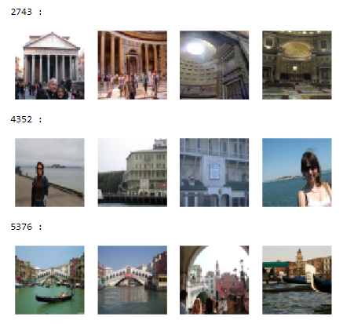
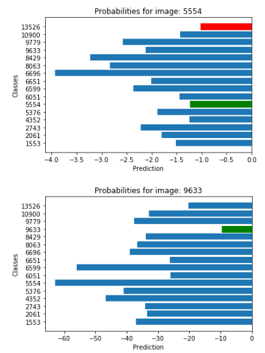

# Training a convolution neural network
Deep Learning/Neural Network final project for COGS 181

 

# Description
I train and validate 5-layer convolutional neural network to classify images from the Google Landmark Dataset. The dataset was taken from Kaggle (https://www.kaggle.com/google/google-landmarks-dataset). I experiment with different activation functions (ReLU, ELU, LeakyReLU, etc.) and various optimization functions to achieve the best validation accuracy. I also observe the model's predictions for each label for various sample images.

My CNN architecture was inspired by the architecture of AlexNet https://papers.nips.cc/paper/4824-imagenet-classification-with-deep-convolutional-neural-networks.pdf.

# Report
You can view my report here: [Project Report](COGS181ProjectReport.pdf) 
